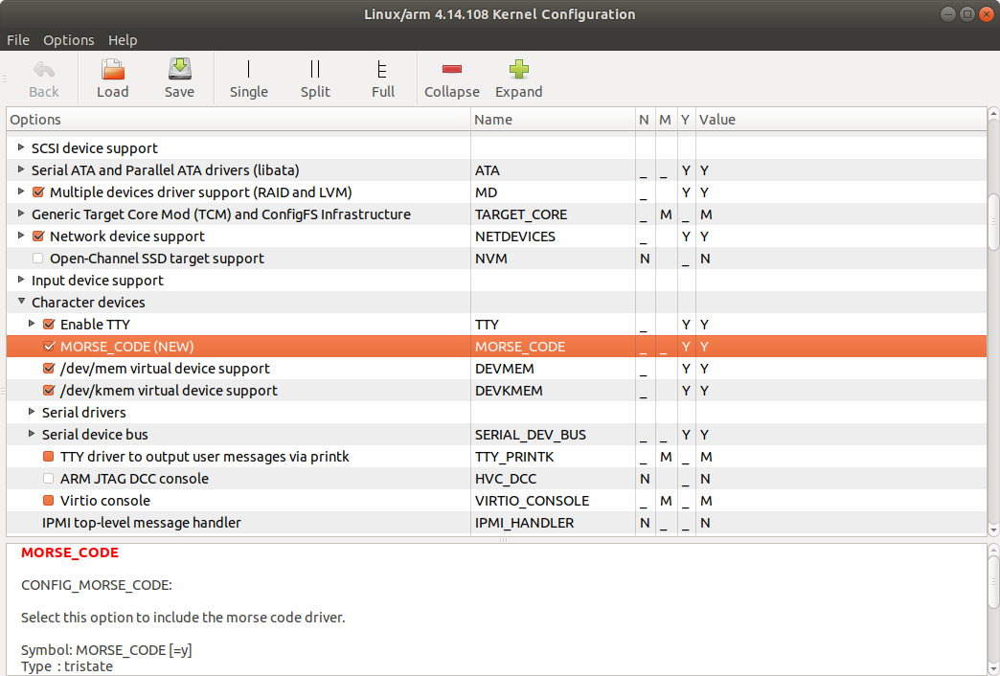
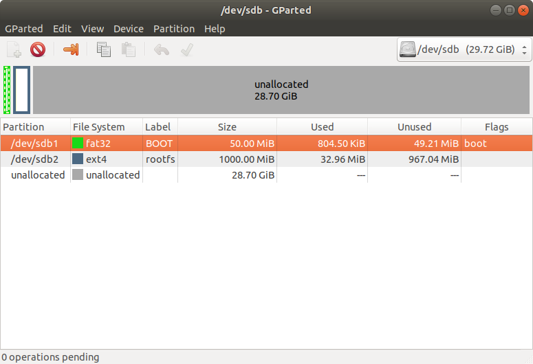
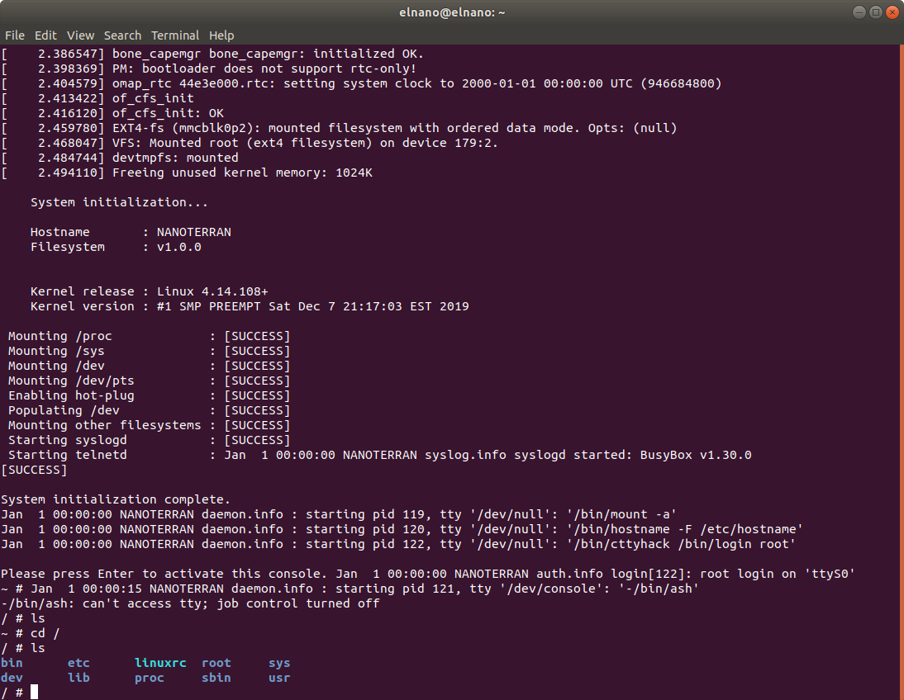

## How to Build a Linux Distribution for the BeagleBone Black

## Introduction
In this tutorial, I will explain how to build your own **Embedded Linux Distribution** for the BeagleBone Black.
During my research, I have found different blogs, tutorials, and other resources about the topic, but most of them are incomplete or out of date.
It was challenging for me when I started, so I hope this tutorial gives you a wider understanding of embedded linux and how to build your own.

To build an **Embedded Linux Distribution** from scratch, for the BeagleBone Black or any other processor, there are many components involved.
The first component you need, is a **Toolchain** to compile and package applications for the BeagleBone Black.
Once you have all the tools, you need a **BootLoader** to provide early initialization initialization so that other programs can run.
Next, you need the **Linux Kernel** which is the main component of your system. 
Lastly, you need a **Root File System** that will contain programs and utilities to boot the system.
It is complicated to build a root file system, however, I will show you how to build a simple one using a tool called **BusyBox**.
Once you have all the components, you will need a micro SD card to boot your binary image.
The micro SD card could be of any size, but I will be using a 32GB one.

#### BeagleBone Black Serial Cable
You will also need a Serial cable for the BeagleBone Black.
It is very important that you have one, otherwise, you will not be able to check if your system is working. 
You can find more about it here: [BeagleBone Black Serial](https://elinux.org/Beagleboard:BeagleBone_Black_Serial)


## Toolchain
The `Toolchain` is one of the most crucial parts of embedded development.
If you do not have the right tools installed on your host development machine, it can impact the success of the project.
For this reason, you need to setup a development environment with the essential tools to successfully build your Linux Distribution.
The first step is to make sure that your host machine is up to date and that it contains the essential utilities.

Before proceeding, create a working area to place the tools and components of the system.
```
cd ~
mkdir EmbeddedWorkspace
cd EmbeddedWorkspace
```

By running the following commands, you can update your machine, install the essential tools, and other tools required for cross compilation.
```
sudo apt-get update
sudo apt-get upgrade
sudo apt-get install build-essential
sudo apt-get install flex bison
sudo apt-get install lzop 
sudo apt-get install u-boot-tools
```
Additionally, you need to install and configure git before building the linux kernel.
```
sudo apt-get install git
git config --global user.email "your_email"
```

#### BeagleBone Black Compiler
Once the host machine is updated, the next step is to download the compiler for the BeagleBone, unzip it, and export it.
```
mkdir arm-toolchain
cd arm-toolchain
wget -c https://releases.linaro.org/components/toolchain/binaries/latest-7/arm-linux-gnueabihf/gcc-linaro-7.5.0-2019.12-x86_64_arm-linux-gnueabihf.tar.xz
tar xf gcc-linaro-7.5.0-2019.12-x86_64_arm-linux-gnueabihf.tar.xz
export ARM_CC=$(pwd)/gcc-linaro-7.5.0-2019.12-x86_64_arm-linux-gnueabihf/bin/arm-linux-gnueabihf-
```
**Important:** If you are running multiple shells, you need to export the compiler for each of the shell.

#### Gconfig Dependencies
The next thing you need, is a configuration subsystem that will allow you to easily configure the **Linux Kernel** and **BusyBox** using a GUI.
There are different configuration subsystems available, but `Gconfig` is one of the simplest to use.
Run the following commands to install GTK (Graphical Toolkit) dependencies:
```
sudo apt-get install libgtk2.0-dev
sudo apt-get install libglib2.0-dev
sudo apt-get install libglade2-dev
```

#### Partition Manager
You also need a partition manager called `Gparted`. This will allow you to partition the SD card into different sections.
Install it using the following command:
```
sudo apt-get install gparted
```
Once you have a solid working environment, the next steps is to construct the [BootLoader](#bootloader).

## BootLoader
The **BootLoader** is a fundamental component in any embedded system.
It plays an important role, initializing critical parts of the hardware that are necessary to get the system to a running state.
There are different bootloaders available, however, I recommend using **U-Boot** because it is well documented and there is a vast amount of resources available.
You can find the source code for **U-Boot** in: [GitHub - u-boot/u-boot: "Das U-Boot" Source Tree](https://github.com/u-boot/u-boot).

#### U-Boot
Run the following commands to download and extract **U-Boot 2018.11** into `~/EmbeddedWorkspace/` directory:
```
cd ~/EmbeddedWorkspace/
wget -c https://github.com/u-boot/u-boot/archive/v2018.11.tar.gz
tar -xvf v2018.11.tar.gz
rm v2018.11.tar.gz
```
**NOTE**: I am using `u-boot-2018.11` because I experienced some issues with newer versions.

#### Configure U-Boot
Next, go into u-boot directory and generate the default configuration for the BeagleBone Black using the defined configuration `am335x_boneblack_defconfig`
```
cd u-boot-2018.11
make ARCH=arm CROSS_COMPILE=${ARM_CC} am335x_boneblack_defconfig
```
At this stage, if you should have the `.config` file as shown below:
```
  HOSTCC  scripts/basic/fixdep
  HOSTCC  scripts/kconfig/conf.o
  YACC    scripts/kconfig/zconf.tab.c
  LEX     scripts/kconfig/zconf.lex.c
  HOSTCC  scripts/kconfig/zconf.tab.o
  HOSTLD  scripts/kconfig/conf
#
# configuration written to .config
#
```
**NOTE:** You can also modify the default configuration if necessary using gconfig:
```
make ARCH=arm CROSS_COMPILE=${ARM_CC} gconfig
```

#### Compile U-Boot
Once the `.config` file has been generated, you can then start to compile u-boot using the following command: 
```
make ARCH=arm CROSS_COMPILE=${ARM_CC} -j4
```
**Note:** If you run into an issue with **evp.h** include: `include/image.h:1101:12: fatal error: openssl/evp.h: No such file or directory`, just run `apt-get install libssl-dev`.

After the `BootLoader` has been compiled, run the `ls` command to make sure that you have the executables shown below.
The ones you care about, are `MLO` and `u-boot.img`.
The `MLO` file is the **first stage BootLoader**, and `u-boot.img` is the **second stage BootLoader** also known as the **Bootstrap Loader**.
```
~/EmbeddedWorkspace/u-boot-2018.11$ ls
api        Documentation  lib           scripts             u-boot.img
arch       drivers        Licenses      spl                 u-boot.lds
board      dts            MAINTAINERS   System.map          u-boot.map
cmd        env            Makefile      test                u-boot-nodtb.bin
common     examples       MLO           tools               u-boot.srec
config.mk  fs             MLO.byteswap  u-boot              u-boot.sym
configs    include        net           u-boot.bin
disk       Kbuild         post          u-boot.cfg
doc        Kconfig        README        u-boot.cfg.configs
```
Later, you will need to copy `MLO` and `u-boot.img` to the boot partition of the SD card. Go to [Boot Partition](#boot-partition) section for more information.

However, we can leave the `BootLoader` for now and move into building the `Linux Kernel`.
At this stage, you should have a workspace with two folders: the `arm-toolchain` and the `u-boot-2018.11`.


## Linux Kernel
In this section, I will show you how to configure the `Linux Kernel` for the `BeagleBone Black`, add a custom device driver, and compile the driver to be part of your kernel. The github source code can be found here: [BeagleBone Linux Kernel](https://github.com/beagleboard/linux)

In the `EmbeddedWorkspace` directory, clone the BeagleBone Black Linux Kernel source code and place it in the directory `elinux`.
**Note:** This will take some time since the linux kernel is huge.
```
cd ~/EmbeddedWorkspace/
git clone https://github.com/beagleboard/linux.git elinux
```

#### Adding a New Device Driver
Once you have the source code, you can customize the Linux Kernel based on what you are building.
I have created a character device driver that will display a welcome message in Morse Code on `LED3`.
Create a directory to place the driver using this command: `mkdir ~/EmbeddedWorkspace/elinux/drivers/char/morse_code`
Next, copy the source code into the new directory, so that the driver becomes part of the kernel when compiled.
```
~/EmbeddedWorkspace/elinux/drivers/char$ ls
agp              generic_nvram.c    misc.c          powernv-op-panel.c  tb0219.c
apm-emulation.c  hangcheck-timer.c  morse_code      ppdev.c             tile-srom.c
applicom.c       hpet.c             mspec.c         ps3flash.c          tlclk.c
applicom.h       hw_random          mwave           random.c            toshiba.c
bfin-otp.c       ipmi               nsc_gpio.c      raw.c               tpm
bsr.c            Kconfig            nvram.c         rtc.c               ttyprintk.c
ds1302.c         lp.c               nwbutton.c      scx200_gpio.c       uv_mmtimer.c
ds1620.c         Makefile           nwbutton.h      snsc.c              virtio_console.c
dsp56k.c         mbcs.c             nwflash.c       snsc_event.c        xilinx_hwicap
dtlk.c           mbcs.h             pc8736x_gpio.c  snsc.h              xillybus
efirtc.c         mem.c              pcmcia          sonypi.c
```
Add to the Kconfig file in `~/EmbeddedWorkspace/elinux/drivers/char/` the following:
```
config MORSE_CODE
  tristate "MORSE_CODE"
  default y
  help
    Select this option to include the morse code driver.
```
Once the Kconfig file has been modified, add the driver to the Makefile to build it into the kernel.
Append `obj-$(CONFIG_MORSE_CODE) += morse_code/` at the end of the Makefile in `~/EmbeddedWorkspace/elinux/drivers/char/` directory.
Finally, create a new Makefile in `~/EmbeddedWorkspace/elinux/drivers/char/morse_code` directory and append the following: `obj-$(CONFIG_MORSE_CODE) += MorseCode.o`.

#### Kernel Configuration for BeagleBone Black
Navigate to the root directory of the linux source code `~/EmbeddedWorkspace/elinux/` and run the following command to create the default configuration for the `BeagleBone Black`:
```
sudo make ARCH=arm CROSS_COMPILE=${ARM_CC} bb.org_defconfig
```
Now that you have a default configuration, run gconfig to add or remove any feature from the kernel.
```
sudo make ARCH=arm CROSS_COMPILE=${ARM_CC} gconfig
```
You should see the device driver under `Device Drivers` > `Character devices`.
To select the driver to be part of the kernel set it to `Y`, be loaded at later time set it to `M`, or if you do not want to included it use `N`.


#### Build the Kernel
Build the kernel and the device binary trees by running the following command:
```
sudo make ARCH=arm CROSS_COMPILE=${ARM_CC} uImage dtbs LOADADDR=0x80008000 -j4
```
You should see this output once the `uImage` is ready.
```
  AS      arch/arm/boot/compressed/piggy.o
  LD      arch/arm/boot/compressed/vmlinux
  OBJCOPY arch/arm/boot/zImage
  Kernel: arch/arm/boot/zImage is ready
  UIMAGE  arch/arm/boot/uImage
Image Name:   Linux-4.14.108+
Created:      Thu Dec  5 09:41:41 2019
Image Type:   ARM Linux Kernel Image (uncompressed)
Data Size:    10035712 Bytes = 9800.50 KiB = 9.57 MiB
Load Address: 80008000
Entry Point:  80008000
  Kernel: arch/arm/boot/uImage is ready
```
After compiling the kernel, build all the modules as follow:
```
sudo make ARCH=arm CROSS_COMPILE=${ARM_CC} -j4 modules
```
**Note:** We will need to install the modules in the root file system latter in this section: [Install Kernel Modules](#install-kernel-modules)


## Preparing the MicroSD Card
Before building the `Root File System`, you need to prepare the micro SD card.
Building the `Root File System` directly into the SD card worked 100% of the time for me.
I ran into issues when building it in the workspace folder and copying it to the SD card. 
You need to create two partitions in the micro SD card, one partition for booting the kernel, and another one for the `Root File System`.
Open `gparted` and select the SD card.

⚠️ **Warning**: Make sure that you have the SD card selected, otherwise, you could partition your hard drive.

If the SD card has any partition, delete it. Next, create a new partition with `50 MiB` for the size. Change the file system type to `fat32` and label it `boot`.

Add a second partition with `1000 MiB` for the size, label it `rootfs`, and make sure that the file type is `ext4`.

After these changes, flag the first partition as boot.

**Important:** If you do not add a boot flag to the first partition, the system might not boot from your SD card.



## Root File System
At this moment, you should have the `BootLoader`, the `Linux Kernel`, and the SD card ready.
Now, you can start to build the `Root File System` using **BusyBox.**
**BusyBox** is a tool that provides minimalist replacements for most of the UNIX utilities.
You need to configure, and build **BusyBox** before installing it on the `rootfs` partition of your SD card.

Navigate to your workspace directory `~/EmbeddedWorkspace/`, download, and extract `BusyBox`.

```
cd ~/EmbeddedWorkspace/
wget -c https://github.com/mirror/busybox/archive/1_30_0.tar.gz
tar -xvf 1_30_0.tar.gz
rm 1_30_0.tar.gz
```
At this point, the workspace should look as follow:
```
~/EmbeddedWorkspace$ ls
arm-toolchain  busybox-1_30_0  elinux  u-boot-2018.11
```

#### Configure BusyBox
Once you download and extract `BusyBox`, you then need to configure it and add the tools that you want in your system.
```
cd busybox-1_30_0/
make ARCH=arm CROSS_COMPILE=${ARM_CC} defconfig
```
Then, run gconfig and select `Build static binary (no shared libs)` under `Build Options`.
```
make ARCH=arm CROSS_COMPILE=${ARM_CC} gconfig
```


#### Build BusyBox
Build **BusyBox** and install it into the rootfs partition of your SD card.
```
sudo make ARCH=arm CROSS_COMPILE=${ARM_CC} CONFIG_PREFIX=/media/<USER>/rootfs/ install
```
**Important:** USER is the name of you computer.
Run `uname -n` to find yours.

Once it is finished, you should see some directories in `rootfs`.
```
cd /media/<USER>/rootfs
/media/<USER>/rootfs$ ls
bin  linuxrc  sbin  usr
```
**Note:** Inside the `bin/` directory you should an executable called `busybox` and many utilities linked to busybox. 

Next you will need to create some important directories and files required by the `Linux Kernel` to boot the system.

#### dev/ Directory
```
mkdir dev
sudo mknod dev/console c 5 1
sudo mknod dev/null c 1 3
sudo mknod dev/zero c 1 5
```

#### lib/ and usr/lib/ Directories
Copy the libraries from the arm toolchain into the root file system lib.
```
mkdir lib usr/lib
sudo cp -r ~/EmbeddedWorkspace/arm-toolchain/gcc-linaro-7.5.0-2019.12-x86_64_arm-linux-gnueabihf/arm-linux-gnueabihf/libc/lib/* ./lib/
sudo cp -r ~/EmbeddedWorkspace/arm-toolchain/gcc-linaro-7.5.0-2019.12-x86_64_arm-linux-gnueabihf/arm-linux-gnueabihf/libc/lib/* ./usr/lib/
sync
```
Create additional directories for mounting virtual file systems.
```
mkdir proc sys root
```

#### etc/ Directory
Create the `etc/` and `etc/init.d` directories and add some important files.
```
sudo mkdir etc etc/init.d
```

#### etc/inittab
After the kernel boots, it spawns the first user process, called the `init`.
`init` is a background process that runs unitil the system is shut down.
This process requires a configuration file called `etc/inittab`, which contains actions the system needs to perform at a given runlevel.

Create a new file called `etc/inittab`:
```
sudo nano etc/inittab
```
Copy the following into the `etc/inittab` file:
```
::sysinit:/etc/init.d/rcS 

# /bin/ash
#
# Start an "askfirst" shell on the serial port
console::askfirst:-/bin/ash

# Stuff to do when restarting the init process
::restart:/sbin/init

null::sysinit:/bin/mount -a
null::sysinit:/bin/hostname -F /etc/hostname
null::respawn:/bin/cttyhack /bin/login root
null::restart:/sbin/reboot
```

#### etc/fstab
```
sudo nano etc/fstab
```
Copy the following into `etc/fstab`:
```
proc    /proc    proc   defaults  0 0
sysfs   /sys     sysfs  defaults  0 0
```

#### etc/hostname and etc/passwd
Create the hostname `sudo nano etc/hostname` and write your hostname.
Then, create passwd `sudo nano etc/passwd` and copy `root::0:0:root:/root:/bin/sh` into it.

#### init.d/rcS Directory
Create the file `init.d/rcS` to setup the system.
Run `sudo nano etc/init.d/rcS` to create the file and append the following:
``` bash
#!/bin/sh
#   ---------------------------------------------
#   Common settings
#   ---------------------------------------------
HOSTNAME=<YOUR_HOSTNAME>
VERSION=1.0.0

hostname $HOSTNAME

#   ---------------------------------------------
#   Prints execution status.
#
#   arg1 : Execution status
#   arg2 : Continue (0) or Abort (1) on error
#   ---------------------------------------------
status ()
{
       if [ $1 -eq 0 ] ; then
               echo "[SUCCESS]"
       else
               echo "[FAILED]"

               if [ $2 -eq 1 ] ; then
                       echo "... System init aborted."
                       exit 1
               fi
       fi
}

#   ---------------------------------------------
#   Get verbose
#   ---------------------------------------------
echo ""
echo "    System initialization..."
echo ""
echo "    Hostname       : $HOSTNAME"
echo "    Filesystem     : v$VERSION"
echo ""
echo ""
echo "    Kernel release : `uname -s` `uname -r`"
echo "    Kernel version : `uname -v`"
echo ""


#   ---------------------------------------------
#   MDEV Support
#   (Requires sysfs support in the kernel)
#   ---------------------------------------------
echo -n " Mounting /proc             : "
mount -n -t proc /proc /proc
status $? 1

echo -n " Mounting /sys              : "
mount -n -t sysfs sysfs /sys
status $? 1

echo -n " Mounting /dev              : "
mount -n -t tmpfs mdev /dev
status $? 1

echo -n " Mounting /dev/pts          : "
mkdir /dev/pts
mount -t devpts devpts /dev/pts
status $? 1

echo -n " Enabling hot-plug          : "
echo "/sbin/mdev" > /proc/sys/kernel/hotplug
status $? 0

echo -n " Populating /dev            : "
mkdir /dev/input
mkdir /dev/snd

mdev -s
status $? 0

#   ---------------------------------------------
#   Mount the default file systems
#   ---------------------------------------------
echo -n " Mounting other filesystems : "
mount -a
status $? 0


#   ---------------------------------------------
#   Set PATH
#   ---------------------------------------------
export PATH=/bin:/sbin:/usr/bin:/usr/sbin:/usr/local/bin


#   ---------------------------------------------
#   Start other daemons
#   ---------------------------------------------
echo -n " Starting syslogd           : "
/sbin/syslogd
status $? 0

echo -n " Starting telnetd           : "
/usr/sbin/telnetd
status $? 0

#   ---------------------------------------------
#   Starts Sending Morse Code in User LED3
#   MorseCode Driver runs as a background process
#   ---------------------------------------------
echo "Starting Morse Code in USR3 LED\n"
echo none > /sys/class/leds/beaglebone\:green\:usr3/trigger
echo "Welcome to Embedded Linux" > /dev/MorseCode


#   ---------------------------------------------
#   Done!
#   ---------------------------------------------
echo ""
echo "System initialization complete."
```
Once you have created this file, you need to assign execution privileges.
Run `chmod +x etc/init.d/rcS`

At the end your file system should look as follow:
```
/media/<USER>/rootfs$ ls
bin         etc         linuxrc     proc        sbin        usr
dev         lib         lost+found  root        sys
```

#### Install Kernel Modules
After creating the above files and directories, navigate to `~/EmbeddedWorkspace/elinux` and install the kernel modules into the `Root File System`.
```
cd ~/EmbeddedWorkspace/elinux/
make ARCH=arm CROSS_COMPILE=${ARM_CC} INSTALL_MOD_PATH=/home/<USER>/rootfs/ modules_install
```

At this stage, the `rootfs` partition of the SD card should be ready with your new `Root File System`.
The next step is to prepare the `BOOT` partition for booting the `Linux Kernel`.


## Boot Partition
Create a boot folder in your workspace directory and copy `MLO`, `u-boot.img`, `uImage`, and `am335x-boneblack.dbt`.
```
cd ~/EmbeddedWorkspace/
mkdir boot
cp u-boot-2018.11/MLO boot/
cp u-boot-2018.11/u-boot.img boot/
cp elinux/arch/arm/boot/uImage boot/
cp elinux/arch/arm/boot/dts/am335x-boneblack.dtb boot/
```

#### uEnv.txt
Go into the `boot` folder and create a file called `uEnv.txt`.
This file will tell the `BootLoader` where to load the kernel image and the device binary tree.
In addition, it should have the arguments that will be passed to the `Linux Kernel`.
```
cd boot/
gedit uEnv.txt
```
Copy the following into `uEnv.txt`
```
uenv_addr=0x81000000
load_addr=0x82000000
dtb_addr=0x88000000
mmc_args=setenv bootargs console=ttyO0,115200n8 noinitrd root=/dev/mmcblk0p2 rw rootfstype=ext4 rootwait
sdboot=echo Booting from SD Card ...;mmc rescan;fatload mmc 0:1 ${uenv_addr} uEnv.txt;env import -t ${uenv_addr} $filesize;fatload mmc 0:1 ${load_addr} uImage;fatload mmc 0:1 ${dtb_addr} am335x-boneblack.dtb;run mmc_args;bootm ${load_addr} - ${dtb_addr} 
uenvcmd=run sdboot

```
**Important:** Leave a newline at the end of the `uEnv.txt` file.

Finally, copy everything from the `~/EmbeddedWorkspace/boot/` directory to the `BOOT` partition of your SD card.
```
cd ~/EmbeddedWorkspace/boot/
sudo cp * /media/<username>/BOOT/
sync
```

Once your SD card is ready, put it into the `BeagleBone Black` and boot from it.
You need to use a **BeagleBone Black Serial Cable** to see the results.


## Final Result
After you boot up the board, the system should mount the root file system successfully and you should automatically be logged in as root `#`.
Besides the Serial output, you should see `LED3` on the `BeagleBone Black` blink at different rates.



## References
**Dr. Alexander Perez-Pons:** http://nweb.eng.fiu.edu/aperezpo/

**Embedded Linux Primer:** https://elinux.org/Embedded_Linux_Primer

**Building Embedded Linux from Scratch:** http://www.bootembedded.com/embedded-linux/building-embedded-linux-scratch-beaglebone-black/

**Boot Beaglebone Black in 60 Minutes:** http://www.blackpeppertech.com/pepper/tech-tree/boot-your-beaglebone-black-in-60-minutes/

**Booting Linux Problems:** http://processors.wiki.ti.com/index.php/Kernel_-_Common_Problems_Booting_Linux

**Root File System for OMAP35x:** http://processors.wiki.ti.com/index.php/Creating_a_Root_File_System_for_Linux_on_OMAP35x#Creating_and_Booting_a_CRAMFS_Root_File_System

**Misc:** https://elinux.org/Beagleboard:BeagleBoneBlack_Rebuilding_Software_Image