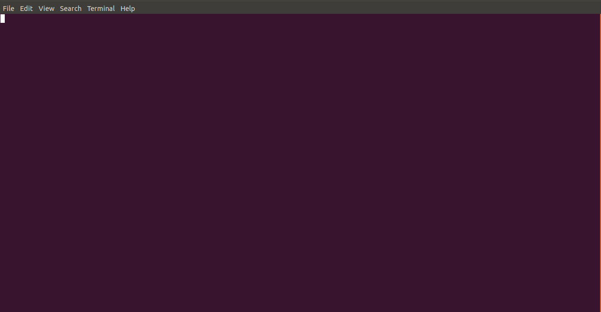
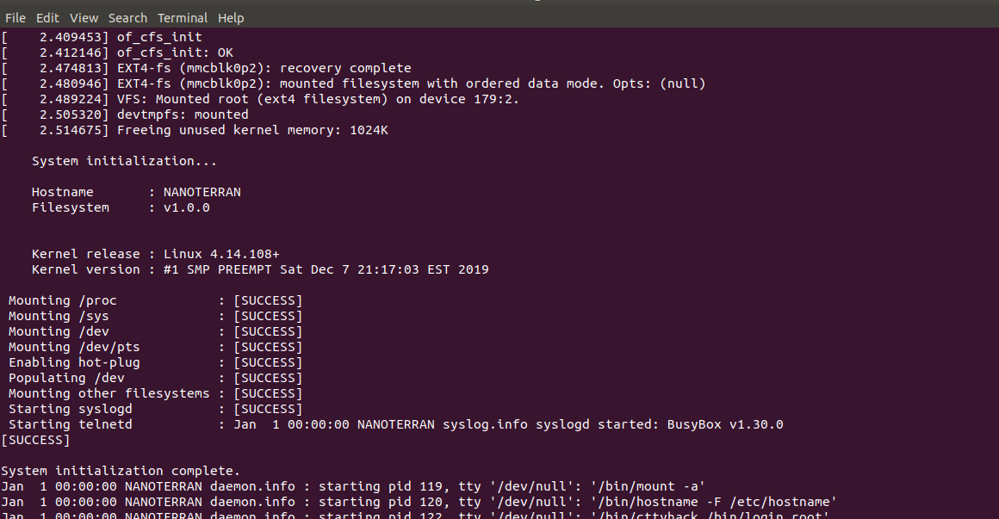
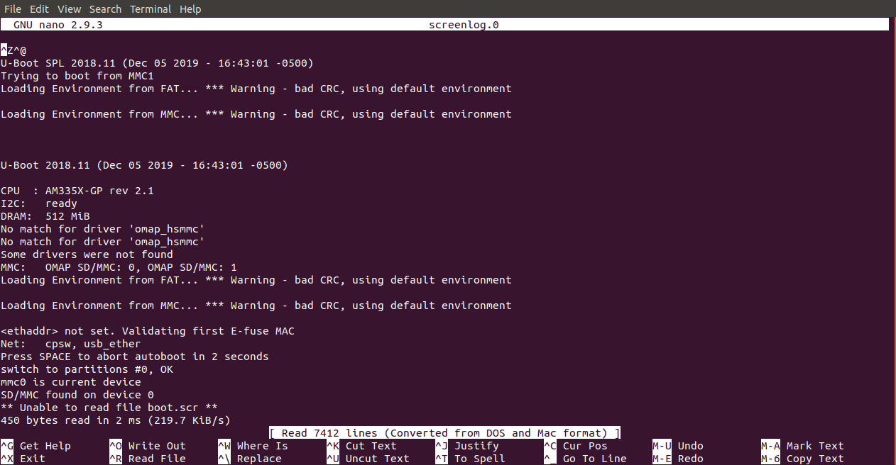

# BeagleBone Black Debugging

_Javier Vega | December 11, 2019_

---

## Introduction
In this article, I will describe how to setup a serial cable for debugging your BeagleBone Black.
As an embedded developer, it is crutial to understand what your board is doing as it initializes.
If you experience booting issues, you might want to gather as much information from the early stages of initialization.
This will give you a better understanding of the issue, instead of randomly trying to solve an unknown problem.

For example, you build a server for the BeagleBone Black.
You want the server to start running as soon as the BeagleBone boots, so you add it to the initialization script.
When you boot your board, the server is not running and you have no clue why.
To find a solution, you first need to find the problem using a [USB-to-TTL Serial Cable](https://elinux.org/Beagleboard:BeagleBone_Black_Serial).
It becomes imposible to find issues of this kind without knowing were the system stoped working.
In addition, if you are building a new Linux distribution, a serial cable is fundamental.
It will help you find issues in the `BootLoader` or the `Linux Kernel` as they starts execute.

## Requirements
* A Linux machine running `Ubuntu 18.04+`
* `screen` Linux tool, to install it run `sudo apt-get install screen`

## General Steps
1. Connect your USB side of the serial cable to your Host machine.
2. Connect the wires to the J1 header pins of the BeagleBone Black following the table below:

	|    Board    |    Cable    |
	| ----------- | ----------- | 
	| Pin 1 (GND) | Black (GND) |
	| Pin 4 (RX)  |	Green (TX)  |
	| Pin 5 (TX)  |	White (RX)  |

3. Open a Terminal Window and run `ls /dev/tty*` to look for the USB device.
If you see `ttyUSB0` or `ttyUSB1`, then your serial is connected.

4. To establish a connection, run `screen /dev/ttyUSB0 115200`.

Once you boot you BeagleBone Black, you should see messages from the `Bootloader` and the `Linux Kernel` on your terminal.

## Writing screen Output to a File
There are times that is difficult to see the errors on a live Terminal Window because the messages are printed too fast.
If you want to log to a file, run `screen -L /dev/ttyUSB0 115200`.
This will create a file `screenlog.0` in the current directory.
To open the file, run `nano screenlog.0`.

## Resources
[How to connect the BeagleBone Black](https://www.dummies.com/computers/beaglebone/how-to-connect-the-beaglebone-black-via-serial-over-usb/)